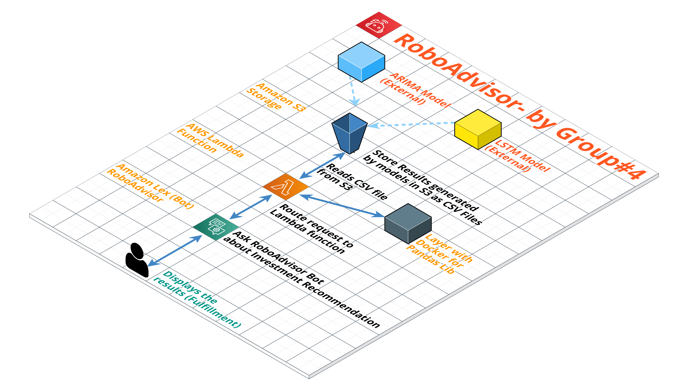
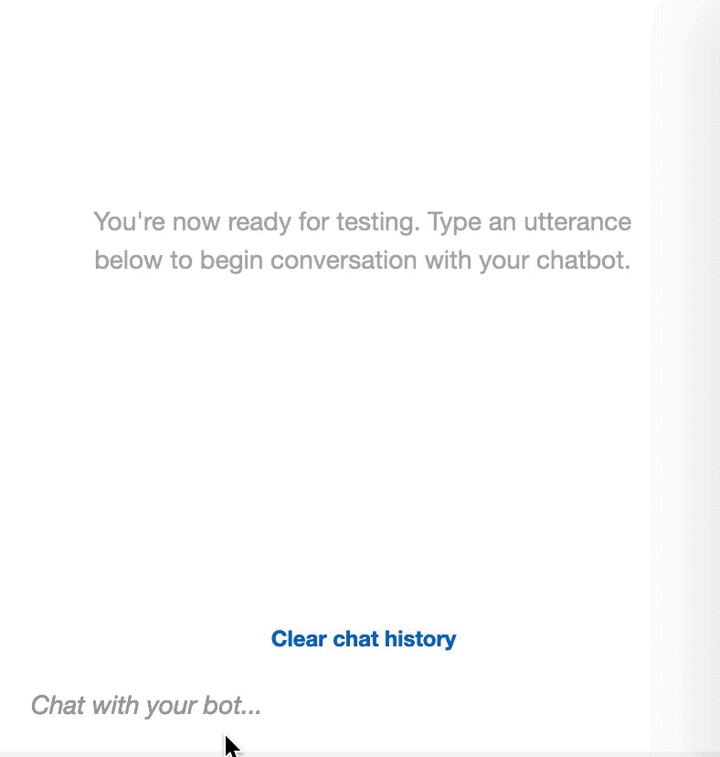

# RoboAdvisor

Using Amazon Web Services we created an Amazon Lex bot with a single intent that establishes a conversation about the requirements to suggest an investment portfolio for retirement. We were able to test the bot and have a conversation by bulding and testing, while enhancing the bot with SageMaker and a lambda funciton that validates the user's input and returns the investment portfolio recommendation.

## Implementing SageMaker

We used SageMaker to pull stock data from Alpaca and run ARIMA and LSTM models based off of daily returns. After ranking the list we were able to output the requested number of tickers inputed by the user and reccomend a portfolio.

An endpoint was created to call Sagemaker from the Lambda Function witht the intention of training the models daily (since we are using daily returns) and saving the outputs as a .csv file in S3.

## Implementing Lambda Function

By creating a lambda function based on the following parameters, we will validate the user provided data and reccomend an investment portfolio based on user input.

* Name
* Age
* Investment Amount
* Number of Stocks
* Investment Horizon
* Risk Level
* Model Type (ARIMA or LSTM)
* Sentiment

#### User Input Validation

* The `age` should be greater than zero.
* The `investment_amount` should be equal to or greater than 5000.

## Architecture

## Testing . . .

